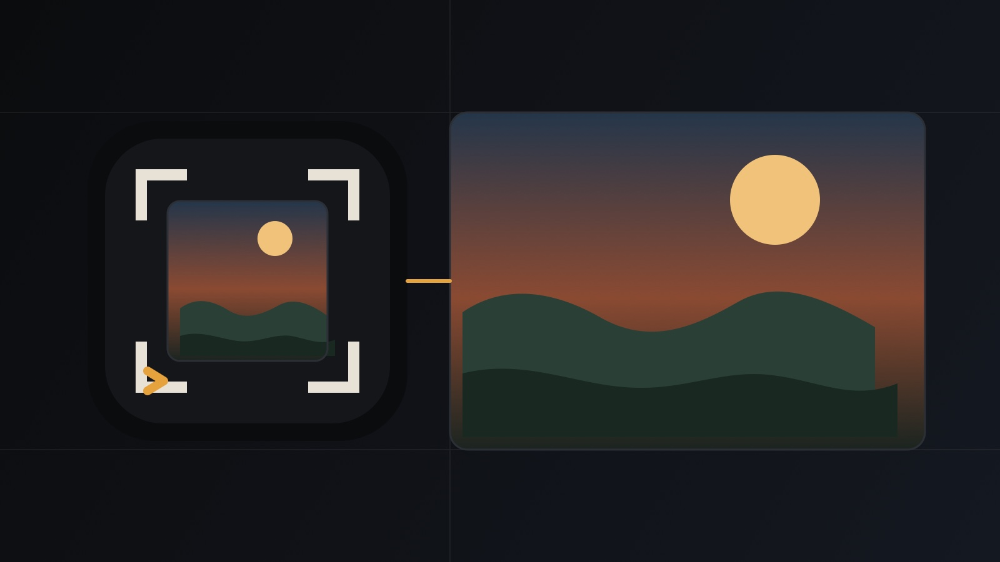

<p align="center">
  
</p>

<h1 align="center">local-image-gen</h1>

<p align="center">
  Generate or edit images from the coding-agent subscriptions already on your machine.<br>
  Official API keys are a fallback, not a prerequisite.
</p>

<p align="center"><a href="README.zh-CN.md">中文说明</a></p>

<p align="center">
  
</p>

Python 3.9+, standard library only. Works as a CLI and as a portable agent skill (`SKILL.md`) for Claude, Codex, Grok, Cursor, Gemini, and similar tools.

## Why this exists

Most image skills ask for a paid API key first. If you already ran `grok login`, `codex auth login`, Antigravity `agy`, or `cursor-agent login`, that session should be enough. This project routes to the local login when it can, then to the matching official API.

It does **not** ship unofficial proxy hosts. API-key calls default to:

| Provider | Official default |
| --- | --- |
| xAI / Grok key | `https://api.x.ai/v1` |
| OpenAI | `https://api.openai.com/v1` |
| Gemini key | `https://generativelanguage.googleapis.com/v1beta` |

Override only when you set `--base-url` or `XAI_BASE_URL` / `OPENAI_BASE_URL` / `GEMINI_BASE_URL`.

## Disclaimer

- This is a local orchestrator for **your** login or **your** official key. It is not a free image gateway.
- Image generation consumes the quota or billed usage of the backend you selected.
- The `codex` provider is **experimental**. It reuses `~/.codex/auth.json` against an unofficial ChatGPT Codex image endpoint. That path can break without notice and may conflict with OpenAI terms. For a supported `gpt-image-2` path, use `--provider openai` with `OPENAI_API_KEY`.
- Review the terms of xAI, OpenAI, Google, and Cursor before you rely on a subscription path.

## Install

One command. It clones or updates `~/.local/share/local-image-gen`, puts `local-image-gen` on your PATH, and links the skill into any coding agent already on this machine (Codex, Claude, Cursor, Grok, Gemini, Trae, Hermes, DeepSeek Harness, OpenCode, and the shared Agents root):

```bash
curl -fsSL https://raw.githubusercontent.com/DandreYang/local-image-gen/main/install.sh | bash
local-image-gen doctor
```

If `~/.local/bin` is not on your PATH, the installer prints the one `export` to add.

From a git checkout, `./install.sh` uses that checkout instead of cloning again. The installer only creates symlinks; it will not replace an existing real skill directory.

Already installed:

```bash
local-image-gen doctor    # backends, Dyro, and whether main is newer
local-image-gen update    # git pull --ff-only, then refresh the wrapper and skill links
```

`update` refuses a dirty checkout, a tree whose git status cannot be read, and a non-git copy. It does not run `curl | bash`. Generate commands never check GitHub for a new version. `LOCAL_IMAGE_GEN_SKIP_UPDATE_CHECK=1` skips the doctor freshness GET (Dyro's 5s spawn should set this).

## Optional Dyro

This project does **not** require [Dyro](https://github.com/DandreYang/DyroEngineeringFlow). It stays a standalone CLI and skill.

If you run it inside a Dyro workspace (an ancestor `dyro.toml`) and omit `-o` / `--out-dir`, images go to `<workspace>/outputs/images` so they stay out of `repositories/` and task worktrees. `-o` always wins.

`local-image-gen doctor` reports backends, whether a Dyro CLI or workspace is present, and whether this install is behind `main`. It does not generate an image. `--doctor` is an alias.

## Usage

```bash
# See what this machine can use
python3 scripts/local_image_gen.py --list-providers
python3 scripts/local_image_gen.py --list-models

# Auto: prefer the current harness login, then any other login, then official keys
python3 scripts/local_image_gen.py "minimal tech cover, no text" \
  --aspect-ratio 16:9 --quality high --optimize auto -o outputs/cover.png

# Grok Imagine 2.0 via grok login
python3 scripts/local_image_gen.py "cinematic night city" \
  --provider grok --model grok-imagine-image-2.0 \
  --aspect-ratio 16:9 --resolution 2k --quality medium -o outputs/city.png

# Nano Banana via Antigravity
python3 scripts/local_image_gen.py "watercolor fox in snow" \
  --provider agy --model gemini-3.1-flash-image \
  --aspect-ratio 3:4 --resolution 2k -o outputs/fox.png

# Official OpenAI Images API
python3 scripts/local_image_gen.py "clean product still" \
  --provider openai --model gpt-image-2 --aspect-ratio 1:1 -o outputs/still.png

# Diagnose without spending quota
python3 scripts/local_image_gen.py "test" --dry-run --aspect-ratio 1:1
```

Agents that have the skill installed should run `scripts/local_image_gen.py` instead of only suggesting a command.

## Providers

| `--provider` | Default model | Subscription / CLI | Official API key |
| --- | --- | --- | --- |
| `auto` | chosen by routing | yes | yes |
| `grok` | `grok-imagine-image-2.0` | `grok login` → `~/.grok/auth.json` | `XAI_API_KEY` |
| `agy` / `antigravity` | `gemini-3.1-flash-image` | local `agy` | — |
| `cursor` | `gemini-3-pro-image` | local `cursor-agent` | — |
| `gemini` | `gemini-3.1-flash-image` | Nano Banana chain: Antigravity → Cursor → key | `GEMINI_API_KEY` |
| `codex` | `gpt-image-2` | experimental `codex auth login` | — (use `openai`) |
| `openai` | `gpt-image-2` | — | `OPENAI_API_KEY` |
| `xai` | `grok-imagine-image-2.0` | — | `XAI_API_KEY` |

`auto` without a named model family prefers Grok, then Codex, then Antigravity (`agy`), then Cursor. A named Nano Banana model still uses Antigravity → Cursor → `GEMINI_API_KEY`. The current harness login still wins when it is usable.

Parameter mapping lives in [`references/providers.md`](references/providers.md). `--list-models` is the executable catalog.

## Prompts

Most people (and most coding agents) do not write a production image prompt. The CLI will not silently rewrite you.

| Flag | What it does |
| --- | --- |
| `--raw` | Send the prompt unchanged |
| `--prompt-profile cover\|poster\|portrait\|product\|edit` | Wrap a short request in a deterministic template. No extra model call |
| `--optimize auto` | Compile short/generic prompts, and remap a prompt written for a different image family. Family-matched text model (Grok login / official keys). Frozen system prompt, no tools, no `agy`/`cursor-agent` |
| `--optimize on` | Always compile for the target family, unless `--raw` or `--provider codex`. Use this when switching Imagine ↔ Nano Banana |
| `--optimize off` | Default. Transport the prompt as given |

`--dry-run --optimize auto` can call the **text** model so you can read `prompt.used` without spending an image. The JSON always includes `prompt.original`, `prompt.used`, and `prompt.optimize`. If you omit `-o`, the default filename hash is the original prompt.

Grammar and examples: [`references/prompts.md`](references/prompts.md).

`--mask` is official OpenAI Images inpaint only (`--provider openai`). Grok Imagine edits take at most 3 reference images.

## Configuration

Keys and optional custom bases, first match wins after process env:

1. `--api-key-file`
2. `./.env`
3. `~/.local-image-gen.env`
4. `~/.config/local-image-gen.env`

See [`.env.example`](.env.example). Never commit a real env file.

CLI override for one request: `--base-url` / `--api-base`. Subscriptions ignore a custom base and keep their official login endpoint.

## Development

```bash
python3 tests/test_local_image_gen.py
python3 scripts/local_image_gen.py --version
```

No third-party Python dependencies.

## License

[MIT](LICENSE)

## Related sibling

[`DyroEngineeringFlow`](https://github.com/DandreYang/DyroEngineeringFlow) (`dyro`) is an optional first-party delivery control plane. Same house, not the same product: this CLI does not require it, and installing one does not install the other. If you already have a Dyro workspace, omit `-o` / `--out-dir` and images go to `<workspace>/outputs/images`.
