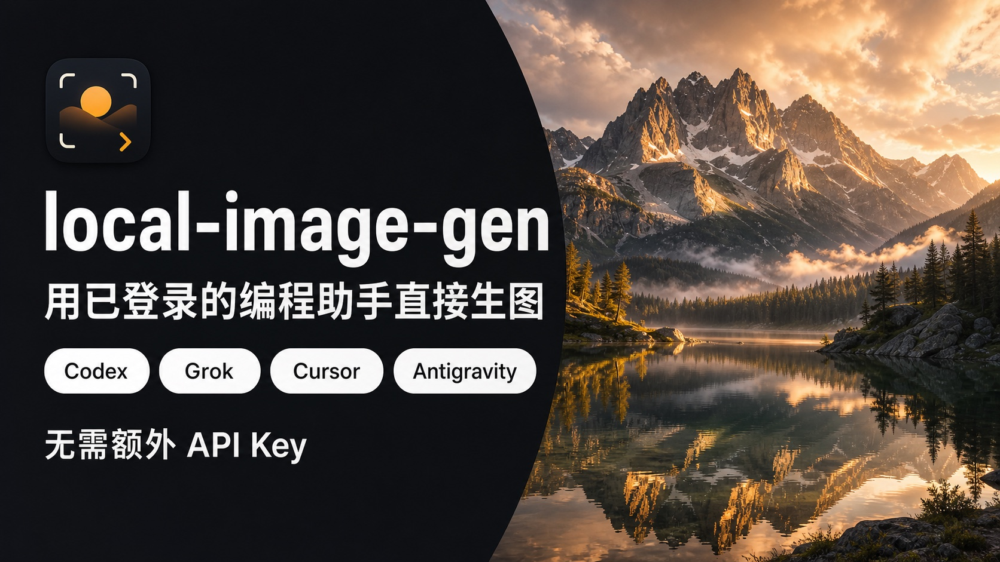

<p align="center">
  
</p>

<h1 align="center">local-image-gen</h1>

<p align="center">
  用本机已经登录的编程助手订阅来生图、改图。<br>
  官方 API Key 只是兜底，不是前提。
</p>

<p align="center"><a href="README.md">English</a></p>

<p align="center">
  
</p>

Python 3.9+，只用标准库。既可以当 CLI，也可以当 Claude / Codex / Grok / Cursor / Gemini 等助手的 portable skill（`SKILL.md`）。

## 为什么做这个

多数生图 skill 一上来就要付费 Key。如果你已经 `grok login`、`codex auth login`、装了 Antigravity `agy`，或登录过 `cursor-agent`，那次登录就应该能用。这个项目先走本地订阅，再走对应官方 API。

仓库**不会**内置非官方中转。API Key 路径默认只打官方地址：

| 供应方 | 官方默认 |
| --- | --- |
| xAI / Grok Key | `https://api.x.ai/v1` |
| OpenAI | `https://api.openai.com/v1` |
| Gemini Key | `https://generativelanguage.googleapis.com/v1beta` |

只有你显式设置 `--base-url` 或 `XAI_BASE_URL` / `OPENAI_BASE_URL` / `GEMINI_BASE_URL` 时才会改地址。

## 使用前请读

- 这是给你**自己的登录**或**自己的官方 Key** 用的本地编排，不是免费生图网关。
- 生图会消耗你所选后端的配额或账单。
- `codex` 供应方是**实验项**：复用 `~/.codex/auth.json` 打未公开的 ChatGPT Codex 生图接口。它可能随时失效，也可能与 OpenAI 条款冲突。需要受支持的 `gpt-image-2` 时，请用 `--provider openai` 加 `OPENAI_API_KEY`。
- 使用订阅通道前，请自行阅读 xAI、OpenAI、Google、Cursor 的服务条款。

## 安装

一条命令。会克隆或更新到 `~/.local/share/local-image-gen`，把 `local-image-gen` 放到 PATH，并链到本机已有的编程助手（Codex、Claude、Cursor、Grok、Gemini、Trae、Hermes、DeepSeek Harness、OpenCode，以及共享的 Agents 目录）：

```bash
curl -fsSL https://raw.githubusercontent.com/DandreYang/local-image-gen/main/install.sh | bash
local-image-gen doctor
```

如果 `~/.local/bin` 不在 PATH 里，安装脚本会打印需要加的那一行 `export`。

带标签的发布： [v0.1.5](https://github.com/DandreYang/local-image-gen/releases/tag/v0.1.5)（[全部 Release](https://github.com/DandreYang/local-image-gen/releases)）。

已经 clone 过的话，在仓库里跑 `./install.sh` 会用当前目录，不会再下一份。安装脚本只建符号链接，不会覆盖已有的实体 skill 目录。

已经装过：

```bash
local-image-gen doctor    # 后端、Dyro，以及 main 是否更新
local-image-gen update    # git pull --ff-only，再刷新包装脚本和 skill 链接
local-image-gen studio            # 打开本机 Studio（监听成功后打开浏览器）
local-image-gen studio --lan --daemon   # 在 Linux 主机上脱离终端；停用 --stop
```

Studio 是同一套 CLI 的本机网页界面。`local-image-gen studio` 默认绑 `127.0.0.1:8765`，服务开始监听后再打开浏览器。`--no-open` 跳过浏览器。`--lan` 绑 `0.0.0.0`，并打印警告：局域网绑定会把这台机器的生图后端分享给网段。机器有公网 IP 时，请用防火墙或安全组限制来源端口；本工具不加登录或 TLS。`--daemon` 脱离当前终端（隐含 `--no-open`）；`local-image-gen studio --stop` 是幂等的。关掉前台终端会停掉 Studio。没有 systemd unit。

`update` 遇到脏工作区、读不了 git status、不是 git 仓库、origin 不是官方 GitHub、或不在 `main`/`master` 会拒绝。它只跑 `git pull --ff-only origin main`。不会再跑 `curl | bash`。生图命令不会去 GitHub 查新版本。`LOCAL_IMAGE_GEN_SKIP_UPDATE_CHECK=1` 会跳过 doctor 的新鲜度 GET（Dyro 的 5 秒 spawn 应设置此项）。

## 可选的 Dyro

这个项目**不依赖** [Dyro](https://github.com/DandreYang/DyroEngineeringFlow)，仍然是独立的 CLI 和 skill。

如果在 Dyro 工作区里运行（上级目录有 `dyro.toml`），又没传 `-o` / `--out-dir`，图片会写到 `<workspace>/outputs/images`，避免落到 `repositories/` 或任务 worktree 里。`-o` 始终优先。

`local-image-gen doctor` 会报告后端、是否检测到 Dyro CLI / 工作区，以及这份安装是否落后于 `main`。不会真正生图。`--doctor` 是别名。

## 用法

```bash
python3 scripts/local_image_gen.py --list-providers
python3 scripts/local_image_gen.py --list-models

python3 scripts/local_image_gen.py "极简科技封面，无文字" \
  --aspect-ratio 16:9 --quality high --optimize auto -o outputs/cover.png

python3 scripts/local_image_gen.py "电影感城市夜景" \
  --provider grok --model grok-imagine-image-2.0 \
  --aspect-ratio 16:9 --resolution 2k --quality medium -o outputs/city.png

python3 scripts/local_image_gen.py "水彩狐狸在雪林里" \
  --provider agy --model gemini-3.1-flash-image \
  --aspect-ratio 3:4 --resolution 2k -o outputs/fox.png

python3 scripts/local_image_gen.py "干净的产品静物" \
  --provider openai --model gpt-image-2 --aspect-ratio 1:1 -o outputs/still.png

python3 scripts/local_image_gen.py doctor
python3 scripts/local_image_gen.py "test" --dry-run --aspect-ratio 1:1
```

已安装该 skill 的助手应直接运行 `scripts/local_image_gen.py`，不要只给命令建议。

## 供应方

| `--provider` | 默认模型 | 订阅 / CLI | 官方 API Key |
| --- | --- | --- | --- |
| `auto` | 自动选择 | 是 | 是 |
| `grok` | `grok-imagine-image-2.0` | `grok login` | `XAI_API_KEY` |
| `agy` / `antigravity` | `gemini-3.1-flash-image` | 本地 `agy` | — |
| `cursor` | `gemini-3-pro-image` | 本地 `cursor-agent` | — |
| `gemini` | `gemini-3.1-flash-image` | Nano Banana：Antigravity → Cursor → Key | `GEMINI_API_KEY` |
| `codex` | `gpt-image-2` | 实验性 `codex auth login` | —（请用 `openai`） |
| `openai` | `gpt-image-2` | — | `OPENAI_API_KEY` |
| `xai` | `grok-imagine-image-2.0` | — | `XAI_API_KEY` |

未点名模型族时，`auto` 优先 Grok，然后 Codex，再 Antigravity（`agy`），再 Cursor。点名 Nano Banana 时仍是 Antigravity → Cursor → `GEMINI_API_KEY`。当前 harness 已登录且可用时，仍优先走当前 harness。

参数对照见 [`references/providers.md`](references/providers.md)。模型清单以 `--list-models` 为准。

## 提示词

多数人和多数编程助手不会写生产级生图提示词。CLI **不会**默认改写你的原文。

| 参数 | 作用 |
| --- | --- |
| `--raw` | 原文直送 |
| `--prompt-profile cover\|poster\|portrait\|product\|edit` | 用确定性模板包一层，不调文本模型 |
| `--optimize auto` | 短/空泛提示词会编译；上一张图若是另一家的成品提示词，也会按目标家族重适配。同族文本模型（`grok login` 或官方 Key），冻结系统提示，无工具，不拉起 `agy` / `cursor-agent` |
| `--optimize on` | 总是按目标家族编译；`--raw` 和 `--provider codex` 除外。Imagine 与 Nano Banana 互转要用这个 |
| `--optimize off` | 默认。原文传输 |

`--dry-run --optimize auto` 可以只打文本模型，看 JSON 里的 `prompt.used`，不消耗生图配额。每次结果都带 `prompt.original` / `prompt.used` / `prompt.optimize`。省略 `-o` 时，默认文件名的 hash 用的是原文。

写法见 [`references/prompts.md`](references/prompts.md)。

`--mask` 只支持官方 OpenAI Images 局部重绘（`--provider openai`）。Grok Imagine 编辑最多 3 张参考图。

## 配置

Key 和可选自定义 base，进程环境之后按下面顺序取第一个：

1. `--api-key-file`
2. `./.env`
3. `~/.local-image-gen.env`
4. `~/.config/local-image-gen.env`

参考 [`.env.example`](.env.example)。不要提交真实 env 文件。

单次覆盖用 `--base-url` / `--api-base`。订阅通道忽略自定义 base，继续走官方登录入口。

## 开发

```bash
python3 tests/test_local_image_gen.py
python3 tests/test_prompt_compile.py
python3 scripts/local_image_gen.py --version
python3 scripts/local_image_gen.py doctor
```

没有第三方 Python 依赖。

## 许可证

[MIT](LICENSE)

## 相关兄弟项目

[`DyroEngineeringFlow`](https://github.com/DandreYang/DyroEngineeringFlow)（`dyro`）是可选的第一方交付控制面。同屋不是同一产品：本 CLI 不依赖它，装其中一个也不会装上另一个。如果已经在 Dyro 工作区里，省略 `-o` / `--out-dir`，图片会写到 `<workspace>/outputs/images`。
